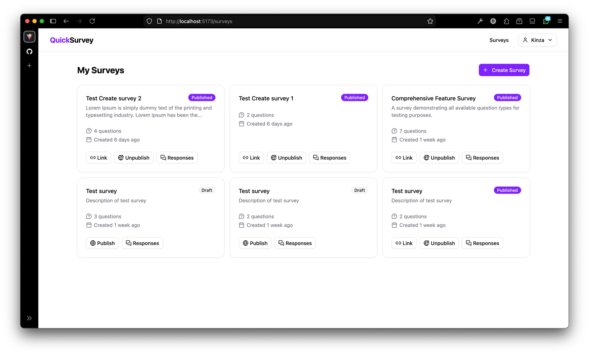
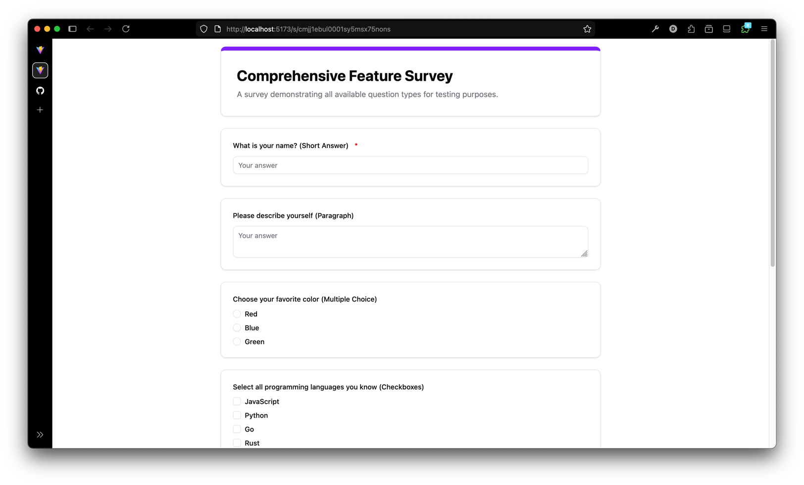
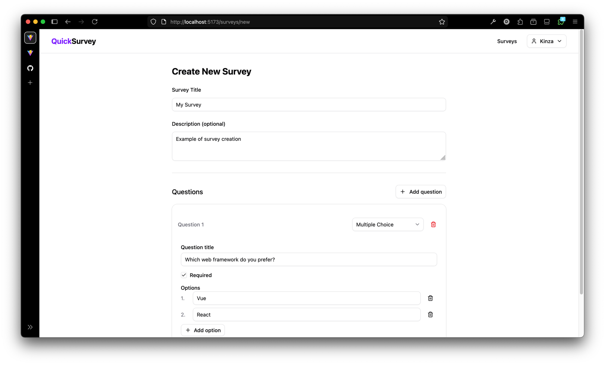
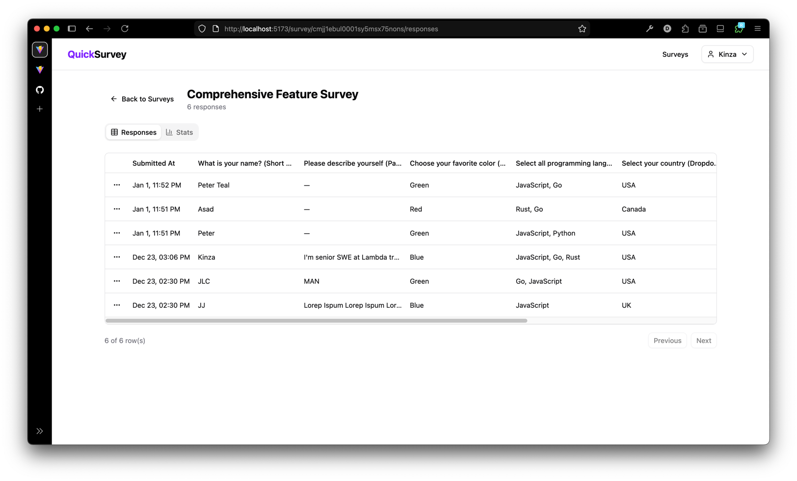
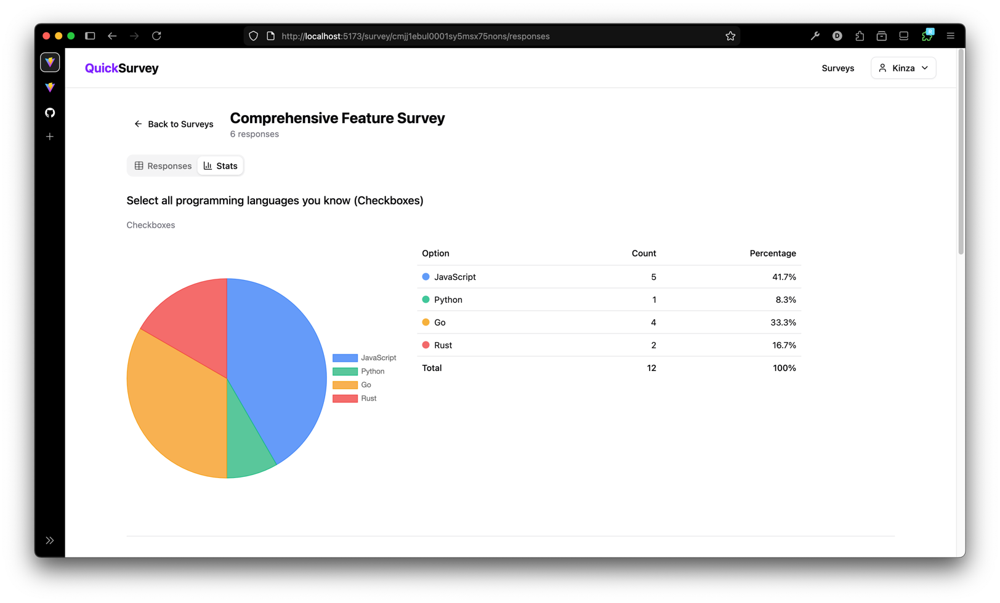
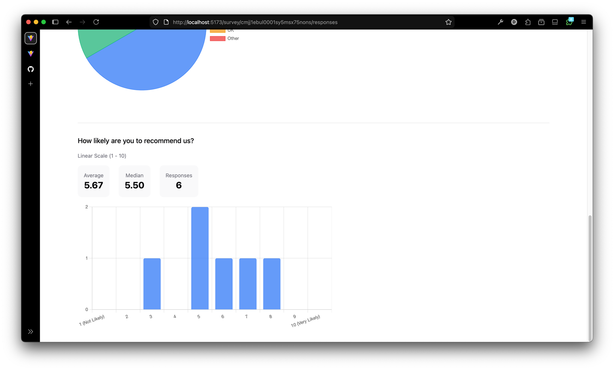

# QuickSurvey

## Screenshots







A monorepo built with **Hono**, **Vite**, **React**, and **Turborepo**.

## 📁 Project Structure

```
QuickSurvey/
├── api/          # Hono backend API
├── client/       # React frontend
├── shared/       # Shared types
├── docker-compose.yaml
├── turbo.json
└── package.json
```

## Getting Started

### Prerequisites

- [Node.js](https://nodejs.org/) (v20+)
- [pnpm](https://pnpm.io/) 
- [Docker](https://www.docker.com/) (for database)

### Installation

```bash
# Clone repository
git clone https://github.com/Remake1/QuickSurvey.git
cd QuickSurvey

# Install dependencies
pnpm install
```

### Environment Setup

```bash
# Copy environment files
cp .env.example .env
cp api/.env.example api/.env

# Edit api/.env with postgres credentials
```

### Start Database and Storage

```bash
# Start PostgreSQL and MinIO
docker-compose up -d
```

### Database Setup

```bash
# Generate Prisma client
pnpm db:generate

# Run database migrations
pnpm db:migrate
```

---

## 🛠️ Development 

### Run Development Servers

```bash
# Run all API + Client
pnpm dev

# Run only API (localhost:3000)
pnpm dev:api

# Run only Client (localhost:5173)
pnpm dev:client
```

### Build

```bash
# Build all packages
pnpm build

# Build specific package
pnpm build:api      # Uses esbuild → api/dist/index.js
pnpm build:client   # Uses Vite → client/dist/
```

### Run Production

```bash
# Start API (after building)
pnpm --filter api start

# Or directly with node
node api/dist/index.js
```


---


## 📦 Package Management

### Install Dependencies

```bash
# Add dependency to specific package
pnpm add <package> --filter api
pnpm add <package> --filter client
pnpm add <package> --filter @quicksurvey/shared
```

### Run Commands in Specific Package

```bash
# Run script in a specific package
pnpm --filter api <script>
pnpm --filter client <script>
```

---

## 📝 Tech Stack

| Package | Technology                             |
|---------|----------------------------------------|
| **api** | Hono, Prisma, PostgreSQL, GraphQL Yoga |
| **client** | React 19, Vite, TypeScript             |
| **infra** | Docker, PostgreSQL, MinIO              |


