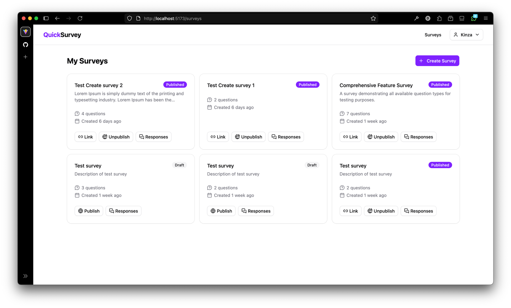
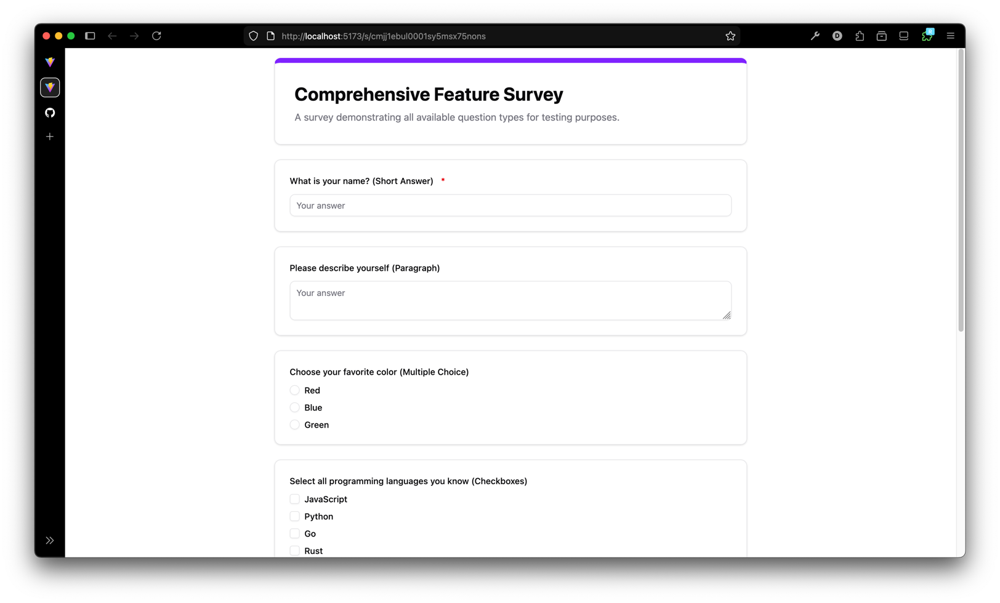
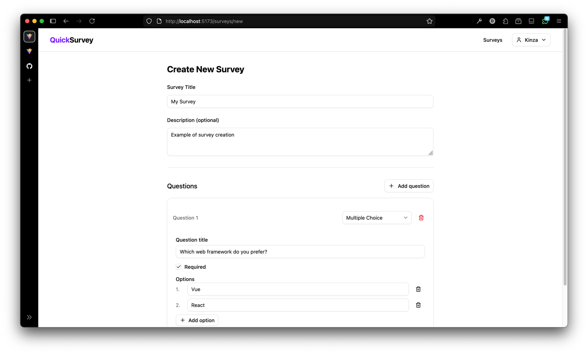
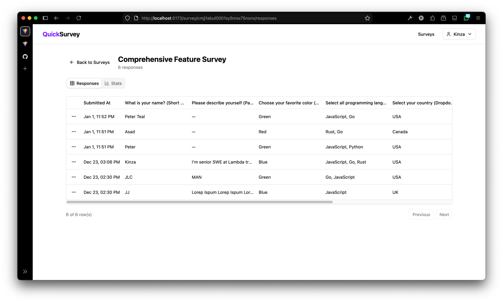
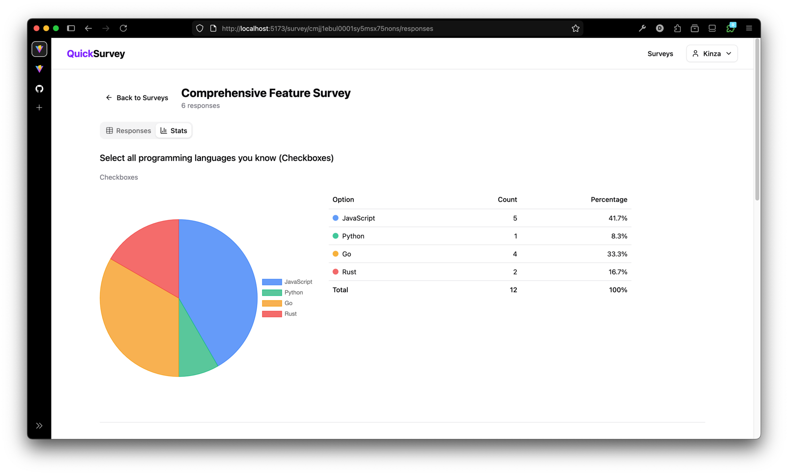
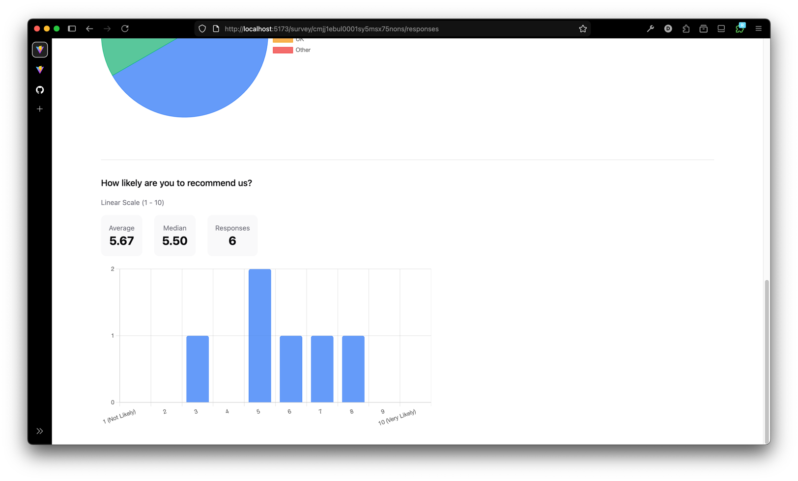

# QuickSurvey

## Screenshots







QuickSurvey is a survey builder with a Go API and React/Vite frontend.

## Project Structure

```text
QuickSurvey/
├── api/          # Go backend
├── client/       # React frontend and frontend-owned schemas
├── shared/       # Shared package
├── docker-compose.yaml
└── README.md
```

## Getting Started

### Prerequisites

- [Node.js](https://nodejs.org/) v20+
- [pnpm](https://pnpm.io/) for the frontend only
- [Docker](https://www.docker.com/) for local infrastructure

### Frontend Installation

```bash
cd client
pnpm install
```

### API Installation

```bash
cd api
go mod download
cp .env.example .env
```

### Environment Setup

```bash
cp .env.example .env
```

### Start Database and Storage

```bash
docker-compose up -d
```

## Development

### Frontend

```bash
cd client
pnpm dev
```

The frontend runs on `http://localhost:5173` and proxies API requests to `http://localhost:3000`.

### Go API

```bash
cd api
go run ./cmd/server
```

The API runs on `http://localhost:3000`.

### Build Frontend

```bash
cd client
pnpm build
```
